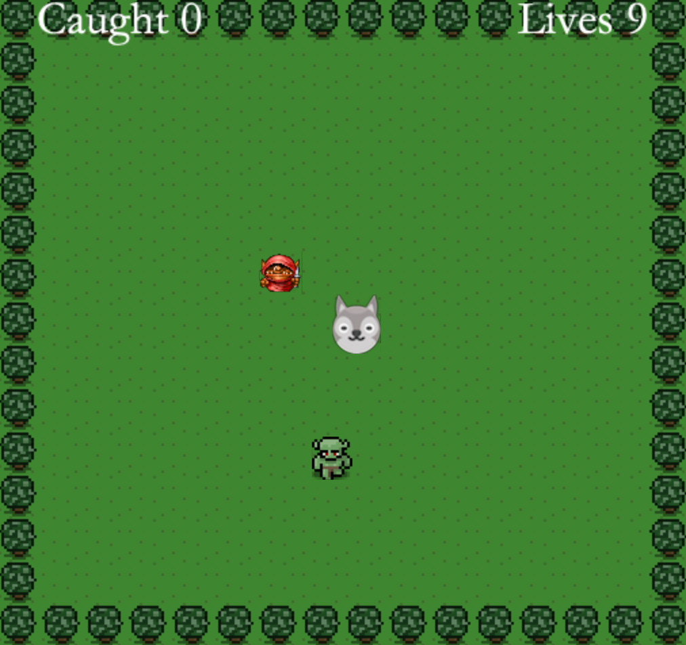

# Catch the Monster

## Contents
- [What It Is](#What-It-Is)
- [What I Used](#What-I-Used)
- [Challenges and Solutions](#Challenges-and-Solutions)
- [Minimum Viable Product](#Minimum-Viable-Product)
- [Stretch Goals](#Stretch-Goals)
- [Screenshots](#Screenshots)
- [Code Examples](#Code-Examples)
## What It Is
Catch the Monster is a game written in Python and the Pyglet library. The challenge of this project was to start with a small codebase. We were tasked with learning how the codebase worked and then adding additional functionality to the game. The idea of the basic game is to navigate the main sprite and catch a small green monster.

I was able to implement the following features to the game:
- Display for points gained and lives lost.
- A red goblin that will cause the player to lose lives every time the two sprites collide.
- After 50 points scored, a second goblin appears on the screen.
- After 100 points scored, a third goblin appears on the screen.
- A goldfish will appear at random that will give the player an extra life on collision.
- Using the Pickle library, I am able to keep track of the high score by storing the high score data in a .dat file.
## What I Used
- Python
- Pyglet
- Pickle
## Challenges and Solutions
- Challenge #1: Comprehending and Building on an Existing Codebase

- Challenge #2: Working with Collisions

- Challenge #3: Writing Code to Handle Multiple Scenarios

## Minimum Viable Product
## Stretch Goals
## Screenshots
## Code Examples

# Setup

First, you'll need to install the `pyglet` library so that `python3` can use it.

In a shell, please run the following command. It does not matter what directory you are in.

```sh
pip3 install pyglet
```

`pip3` is a program that comes with `python3` and it can download and install free python libraries from the Internet.

On your computer, the program might be called `pip` instead of `pip3`. If `pip3 install pyglet` gives you an error, try `pip install pyglet`.

# The game

To run the game, use the following command:

```sh
python3 app.py
```


# Explore

- Move the score text so it's not in the way ;)
- Change how fast our player can move
- Reduce the chance the monster will change direction to 20%
- Replace the monster's image with the `goblin.png`
- Play a different sound when you catch a monster

# Improve

## Small

- When the hero catches a monster, increase the score by 10
- When the score reaches 100, call the `game_over()` function
    - When the game is over, display a "You won" message and play the "win" sound effect
- Change the score label either using a different font or by using HTML: https://pyglet.readthedocs.io/en/latest/modules/text/index.html
- Download some (free!) graphics from [kenney.nl](https://kenney.nl/assets?q=2d) and replace the hero and monster. (Cats, maybe??)

## Medium

- add a goblin to the game
    - use the `goblin.png` image in the `resources` folder
    - The goblin should try to catch the hero
        - If the goblin touches the hero, it takes one life
        - If the hero loses 3 lives, the game is over
            - Stop playing the music and play the 'lose' sound
    - Add a "lives" text display next to the score.

- Add a magical item at random to the screen:
    - Each magical item enhances our hero's abilities (or bestows new ones)
    - The 'bullet' increases the hero's speed temporarily
    - The 'flame' allows the hero to shoot goblins (thus taking them off screen)

## Large

- As the player's score increases, add more goblins

- Add an 'stone' the screen for saving the state of the game, including the score, number of lives, magical abilities, and position of each character on the screen.
    - It should only appear temporarily.
    - If the player loses all their lives, ask if they want to load their saved game.
        - Optionally, delete the saved game info so the player can only use a saved game once.
